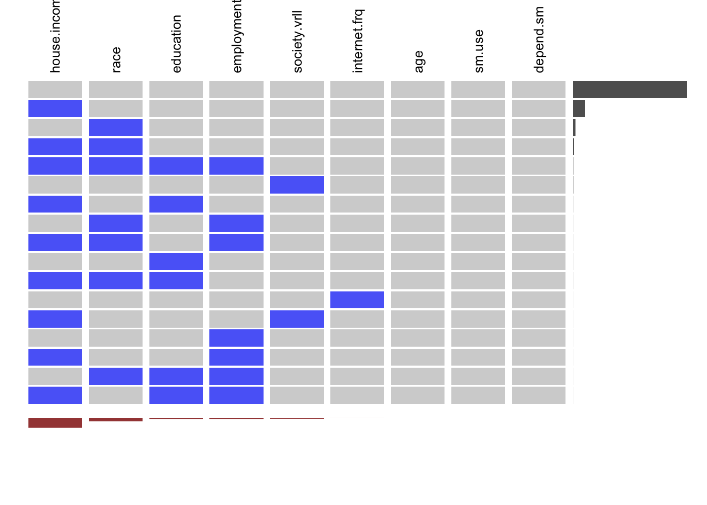
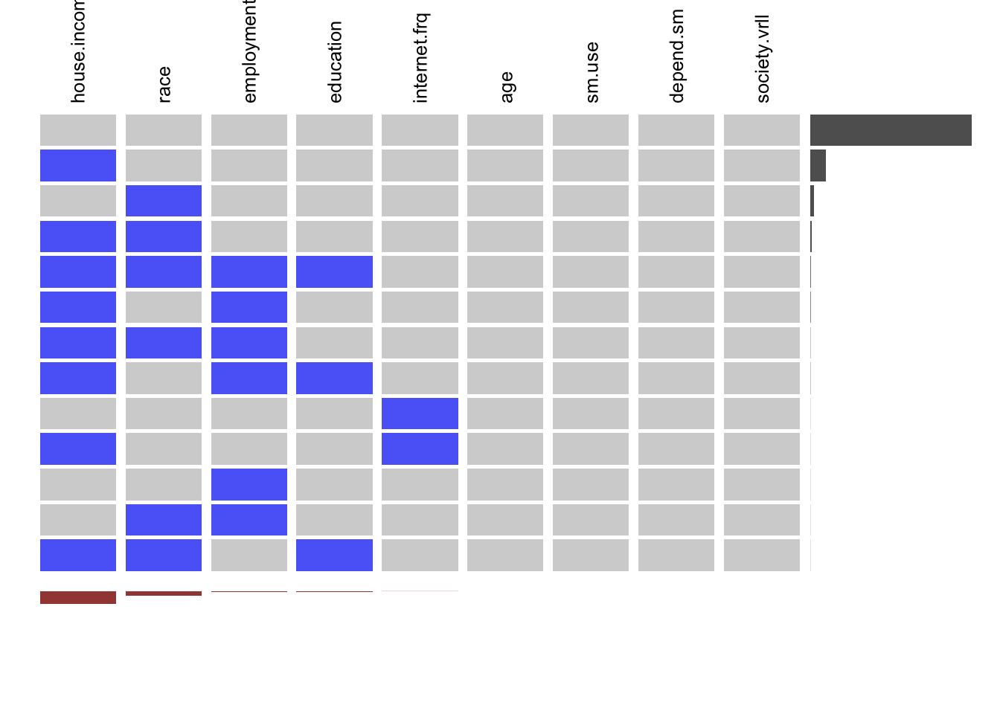

---
output:
  html_document: default
editor_options: 
  chunk_output_type: console
---

# Missing Values


In the missing pattern analysis, we have considered some important responses which are mainly core data to figure out the trends. The selected variables are year, state, age, education, employment, house. income, race, internet.freq, sm.use, society.overall and depend.sm.


```
## NOTE: The following pairs of variables appear to have the same missingness pattern.
##  Please verify whether they are in fact logically distinct variables.
##      [,1]     [,2]             
## [1,] "sm.use" "society.overall"
```


|                 Missing Patterns                  |
|:-------------------------------------------------:|
|                      nothing                      |
|                     depend.sm                     |
|                   internet.freq                   |
|             internet.freq, depend.sm              |
|        sm.use, depend.sm, society.overall         |
| internet.freq, sm.use, depend.sm, society.overall |


Taking all together, we have identified that a large number of missing values are in the variable of social media use, overall society, and dependency on social media. Some values are also missing in the frequency of internet use.

We then try to analyze the missing value by dividing it into groups by year.

## Missing Value Patterns

We begin by looking at the missing data by year. First 2018.


In 2018, all the missing values are for the variables "dependent on social media" and "internet frequency"
More than 5% of the data is missing for both the variables. Nearly 75% of the data is missing for nothing.
 
Now we look at 2019.


```
## NULL
```

In 2019, we observe only 2 missing patterns. All the 3 variables "social media use", "society overall" and "depend on social media" are missing for all data. Perhaps, these are the questions were not asked in the 2019 survey. However, 5% of data for internet frequency is missing along with other variables.

Apart from missing data, we have also analyzed the data where responded refused to answer or chose an answer as "Don't know"

## "Don't Know" Response Patterns


1) 2018


2) 2019


In 2018, we see that a number of people answered: "Don't Know" for the response of house.income, race, education, social.overall and internet.freq. There is also a few people answered "Don't Know" for employment. But in 2019, relatively fewer people answered "Don't Know"


## "Refused" Response Patterns

1) 2018



2) 2019




In 2018, a lot of people refused to answer on house income, race, education, and employment. We also see the same pattern of response in 2019.

