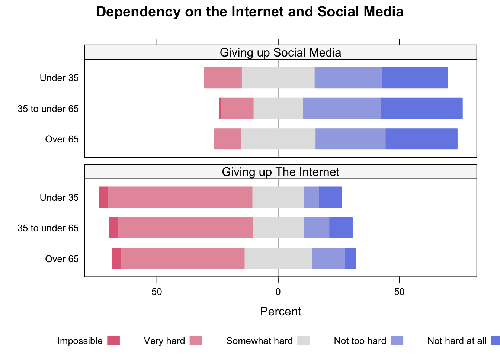
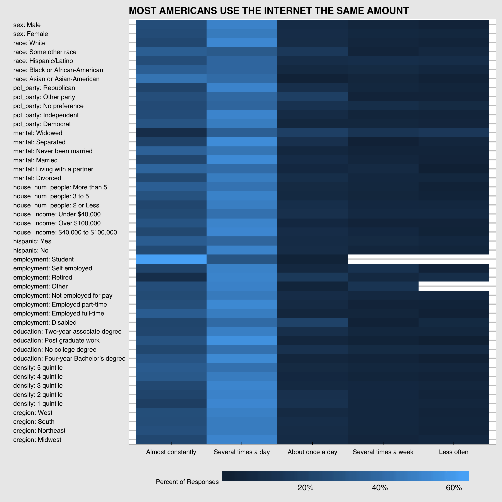
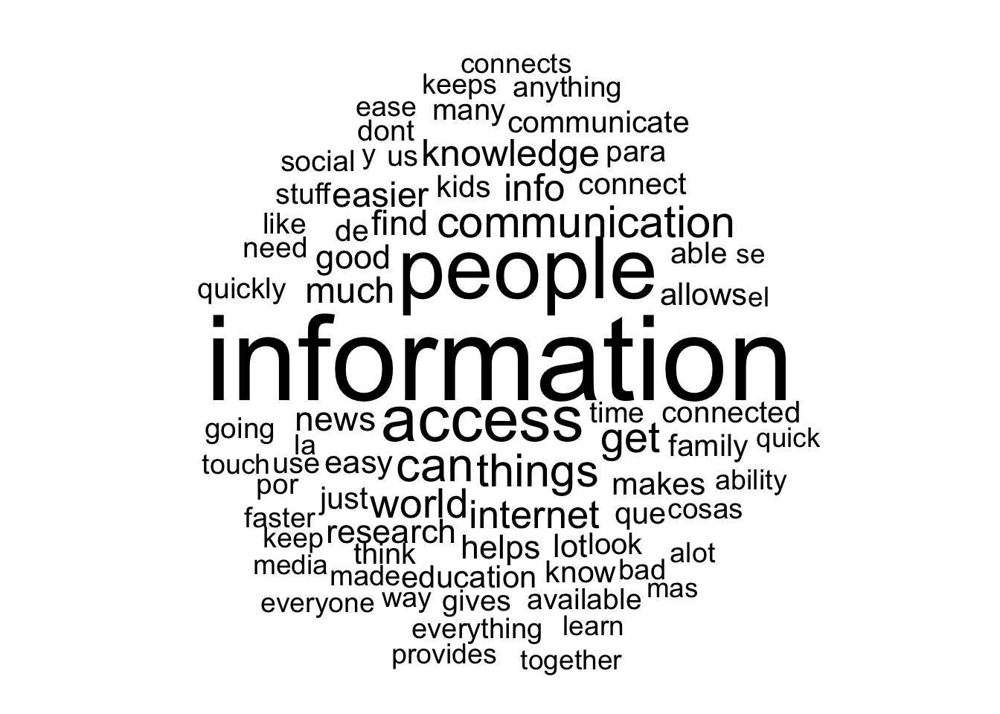

# Results

## Internet Usage

> "The U.S. has 4% of the world's population, 10% of its Internet users and 25% of its broadband investment."
>
> <footer>--- NCTA</footer>

### Connectivity

The internet is a vital aspect of modern society, and it's existence has affected every area of human life. Americans reap the benefits of impressive internet speeds and and consistent coverage that enables them to utilize the internet in many facets. In 2019, 81% of Americans subscribed to home internet services and of those, 92% of had access to high speed internet.

(\#fig:unnamed-chunk-1)On the left: the break down of internet speeds in the entire United States. This percentage is out of only people who answered they subscribed to internet services at home. On the right: the percentage of adults in the US that subscribe to internet services at home.

### Interent as a Whole

Of these people that subscribe to interent services, the next step is to investigate how much people use it. There is an unwaivering similarity between internet happits in 2018 and 2019. In 2018, more than 77% of Americans over the age of 18 used the internet at least once per day, and in 2019 that number rose to over 82%. The vast majority of respondents admit to using the internet "several times a day" in both years, and the majority of the remaining people use it constantly. This means that for the most part, if someone subscribes to the internet, they are using it quite a bit. Unfortunately there is no further questioning about the where the time people put into the internet goes other than social media, so this information does not speak about used for work or leisure. Regardless, it is telling about our modern society that so many people are open to sharing this habbit. 

(\#fig:unnamed-chunk-2)The breakdown of internet usage, faceted by year, for all adults in the US.

### Social Media Usage

(\#fig:unnamed-chunk-3)The breakdown of how adults in the US use social media by how much they use the internet. The percentages are taken within each internet usage group, across both 2018 and 2019.

(\#fig:unnamed-chunk-4)Breakdown of multiple social media usages, across both 2018 and 2019 by age. This graph was generated with the HH package.

## Demographics: Age, Income, and the Internet

(\#fig:unnamed-chunk-6)AC: Almost constantly; SD: Several times a day; LO: Less often. This graph was generated by the vcd pacakge, and uses data from both 2018 and 2019.

(\#fig:unnamed-chunk-7)Using multiple categorical values, the distribution of internet frequency responses were caluclated for each feature:value pair.

## Sociey's Opinion: Internet Impact on Society

So far, it seems that regardless of a person's age, financial status, houshold, political nature, really background characteristics, Americans, for the most part, use the internet the same amount. So, since it is established that the internet is popular, why is this so? One of the most interesting series of questions asked by the Core Trends survey is about the societal impact of the internt: has the internet been a bad or good thing for both society and why? Unfortunately, this question series was only asked in 2018, but the single year offers some interesting insights into American's opinions of the internet.

