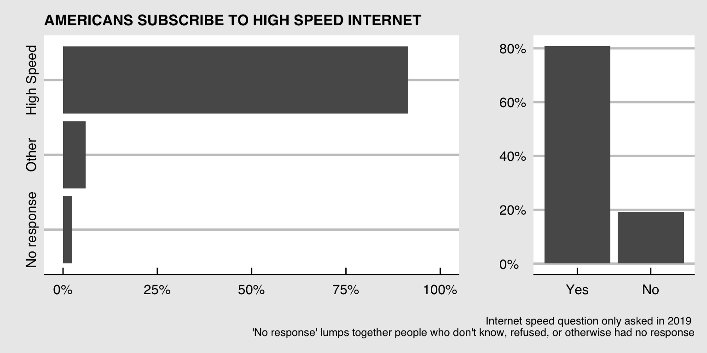
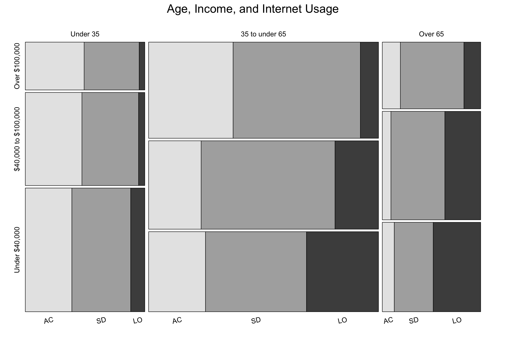

# Results

## Internet Usage

> "The U.S. has 4% of the world's population, 10% of its Internet users and 25% of its broadband investment."
>
> <footer>--- NCTA</footer>

### How many people have access to the internet?

The internet is a vital aspect of modern society, and it's existence has affected every area of human life. Americans reap the benefits of impressive internet speeds and and consistent coverage that enables them to utilize the internet in many facets. In 2019, 81% of Americans subscribed to home internet services and of those, 92% of had access to high speed internet.

(\#fig:unnamed-chunk-1)On the left: the break down of internet speeds in the entire United States. This percentage is out of only people who answered they subscribed to internet services at home. On the right: the percentage of adults in the US that subscribe to internet services at home.

### How much do people use the internet?

Of these people that subscribe to interent services, the next step is to investigate how much people use it. There is an unwaivering similarity between internet happits in 2018 and 2019. In 2018, more than 77% of Americans over the age of 18 used the internet at least once per day, and in 2019 that number rose to over 82%. The vast majority of respondents admit to using the internet "several times a day" in both years, and the majority of the remaining people use it constantly. This means that for the most part, if someone subscribes to the internet, they are using it quite a bit. Unfortunately there is no further questioning about the where the time people put into the internet goes other than social media, so this information does not speak about used for work or leisure. Regardless, it is telling about our modern society that so many people are open to sharing this habbit. 

(\#fig:unnamed-chunk-2)The breakdown of internet usage, faceted by year, for all adults in the US.

### How much do people use social media?

Social media is one of the most popular and diverse family of applications on the internet. Facebook, Twitter, Youtube, and Instagram are some of the most used *things* ever. Riding on the subway, walking the streets, or sometimes even sitting in class if you look around, you are bound to find someone using one (if not more than one) of these apps. With mobile and standard browser versions, the apps are versitile enough to accomodate every possible user. 

We would like to breakdown how much people spend their time on the internet using social media.

(\#fig:unnamed-chunk-3)The breakdown of how adults in the US use social media by how much they use the internet. The percentages are taken within each internet usage group, across both 2018 and 2019.

Constant internet users tend to spread out there time over multiple apps rather than just using Youtube and Facebook. An abnormal proportion of internet users, regardless of ther usage, actually only use Youtube once a day. Perhpas this means most people have one "binge" session per day. As the usage of the internet decreases, the more people tend to use less apps than just Youtube and Facebook. For less frequent internet users, they acutall use these two services more than constant internet users. This suggests that these are the only apps they are using. 

### How does age affect social media use?

(\#fig:unnamed-chunk-4)Breakdown of multiple social media usages, across both 2018 and 2019 by age. This graph was generated with the HH package.

It is pretty clear that young people use many social media apps, and as people age, they begin exclusively using facebook. 

### How much do people depend on the internet and social media? 

People of all ages seem to be in agreement thay giving up social media would not be the end of the world, but that giving up the internet entirely is "very hard." There is a slight trend that older people are more willing to give up internet related things, but it is still curious that people think this way. It might be related to the fact that other services exist outside the current social media platforms, and the internet provides other ways to keep in touch with people. 

## Internet Accross the United States

We want to investigate how people's background, area, income, and other demographical information affect internet usage. 

For an exploration of social media usage across the US states, please see Chapter 6.

### How does age and income affect internet usage?

We were interested in how does wealth factor into people's internet usage. It is clear that younger people use the internt more than older, but is this true for levels of wealth? 

(\#fig:unnamed-chunk-6)AC: Almost constantly; SD: Several times a day; LO: Less often. This graph was generated by the vcd pacakge, and uses data from both 2018 and 2019.

It is not true for all age of wealth. Wealth does cause an increase in internet usage across all age groups, but the effect is much more dramatic the older you get. For the most part, young people will use the internt regardless of their income. Older people however will have a significant decrease in the number of internet users if they make less than $40,000 a year. Age definitly puts a learning curve on internet devices, but wealth seems to remedy this problem.

### Does any demographic have a significant impact? 

The Internet Core Trends Survey includes many other demographics about the respondents. We looked at many of these but were unable to find many significant trends. 

(\#fig:unnamed-chunk-7)Using multiple categorical values, the distribution of internet frequency responses were caluclated for each feature:value pair.

By looking at almost all of the demographic information against internet usage frequency, we determined that there is no feature that has a major effect on internet usage. There are some outliers that stand out, like the fact that students have much higher frequency, and widowed and retired people have a lower frequency. Despite this, there is not really a clear trend within an entire variable, making the point that regardless of background, most people just like using the internet. 

## Sociey's Opinion: Internet Impact on Society

So far, it seems that regardless of a person's age, financial status, houshold, political nature, really background characteristics, Americans, for the most part, use the internet the same amount. So, since it is established that the internet is popular, why is this so? One of the most interesting series of questions asked by the Core Trends survey is about the societal impact of the internt: has the internet been a bad or good thing for both society and why? Unfortunately, this question series was only asked in 2018, but the single year offers some interesting insights into American's opinions of the internet. Above are the most common words used to describe the impact of the internet. 

### Is the internet good for society? 

Respondents were asked two questions: overall, is the internet good for society? personally, is the internet good for society.

In an overwhelming majority, the internet has been a good thing. There is an increase in the number of "Good thing" responses from the overall question to the personally question. This suggests that people think there are some negatives for the enirety of society, but the discrepency might come from the idea that the internet is good for them. 

### How do people describe the impact of the internet?

Why people think the internet is good or bad is interesting. We examined the most important words used when describing the internet by the way they answered the society impact questions. 

These words are very telling. On the left, we have the words that positively describe the internet, and on the right are the words that negatively describe the internet. On the positive side, the internet is fast, helps connect people, provides knowladge, and is educational. However on the bad side, the internet is a place for bullies, people are anonymous, there are issues with privacy, people commit crimes, people are pushed to suicide. There are more unique reasons that the internet is a bad thing than good, yet still the overwhelming opinion is positive. 
